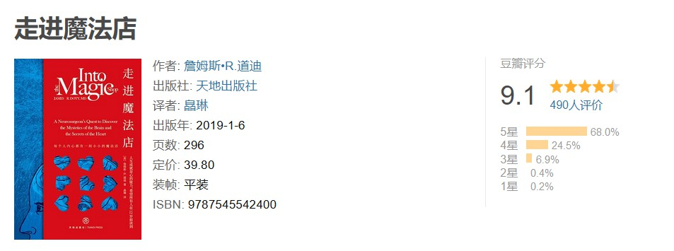

#! https://zhuanlan.zhihu.com/p/600080249
# 《走进魔法店》：冥想训练的入门

对我来说，冥想训练或许是眼下迫切需要尝试的一种心理疗愈手段。因为在过去的四五年间，我在心理健康上遇到了不小的问题，以至于常常对一些所见所闻的事情感到难以排解的愤怒与悲观。所幸的是，我还能意识到这种长期的、无法排解的负面情绪已经开始影响到了自己的日常生活和工作效率，因而开始有了一些自我警觉。于是就开始寻找一种能让自己静心下来，排除杂念，集中于眼下所做之事的方法，然后得知冥想训练是个不错的选择，为此就打算找一本入门读物开始试试看。

关于冥想的入门指导，我之前曾经在知乎上了解到一个观点：真正关于冥想方法的好书都不是专门写冥想的，从冥想本身要远离急功近利的心态来看，我认为这个观点是靠谱的，于是我就在这个观点的下面看到了关于《走进魔法店》这本书的推荐。从书本身的内容来看，它实际上一位著名的脑神经外科医生的自传。作者在书中详细地描述了自己是如何学习冥想，并通过冥想训练从一个父亲是酒鬼，母亲常年重度抑郁的糟糕家庭环境的，穷困潦倒的小孩成长为斯坦福大学教授，著名脑神经外科医生的。

毫无疑问，这真的可以称得上是一本魔法书。我从中不止学到了冥想训练的基本方法，也从科学的角度理解这种训练的意义。人们在阅读它时能收获平静、感动，也会得到鼓励和温暖。它能让人去思考生活的本真，找到自我认同感，坚信自己可以成为想要成为的人，并与周围这个世界和平共处。关于书中提到的几个冥想步骤，是非常质朴且可行的，任何人都可以立即开始练习。

值得一提的是，这本书在写法上也是非常干净利落的，它从前言部分开始就直接进入主题，引人入胜，因为作者从给一个小男孩做的一次惊心动魄的脑部手术切入，直观地给读者呈现了冥想训练能给人带来的变化。如果一个人在任何时候，任何情况下都能进入到一个异常专注，没有杂念的状态，这将是一个多么强大的存在啊！怎么能不让人向往呢？希望对我来说，这个训练不会来得太晚。
